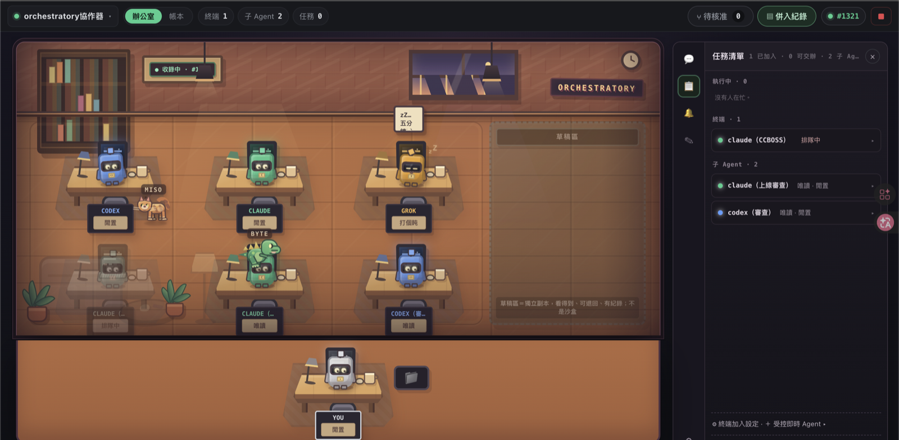
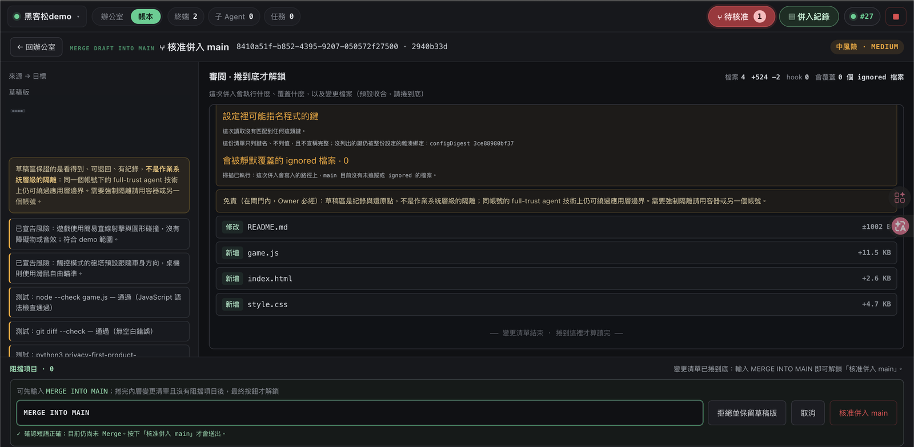
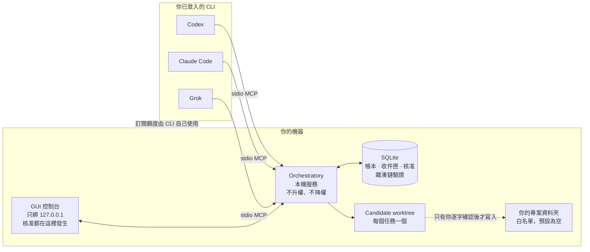

# Orchestratory

**讓 Codex、Claude Code 與 Grok 在同一個房間裡協作，user保留唯一的核准權。**



*同一個房間裡的 codex、claude 與 grok 席位。右側草稿區標著它自己的限制：**獨立副本，看得到、可退回、有紀錄；不是沙盒**。*



*寫入你的專案是一道獨立閘門。捲完變更清單才解鎖輸入，逐字打出 `MERGE INTO MAIN` 之後**仍未合併**——還要再按一次。免責聲明就放在做決定的那一格裡。（左側本機路徑已遮蔽。）*

**[▶ 90 秒展示影片](https://www.youtube.com/watch?v=wS8F4vVaAvA)** ｜ **[互動式席位手冊](https://gn01226919.github.io/orchestratory/orchestrator-seat-handbook.html)**

## 問題與目標

我寫程式時會同時用 Claude、Codex、Grok 交叉協作——同一廠牌的 agent 有設計上的偏好偏差，
換一家才看得出盲點。但每開一個新 session、每換一個 agent，我就得**從頭交代一次專案**：
現在做到哪、為什麼這樣做、上次那個決定是誰下的。

**累的不是技術，是每次都要重講。**

想像一間公司，所有資料都開源，每個新進員工報到時都拿到一本手冊，上面寫著他即將面對的工作
與過往所有進度——這樣就不需要任何人重新交代任何事。

**那些新進員工就是 agents，手冊就是 Orchestratory 的帳本，公司就是每一個獨立專案。**

跨廠牌、跨模型、跨 session。

而且它順手解決了另一件事：多個 agent 同時動一個 repo 時，你原本沒有一個地方能看到
「誰、在什麼依據下、做了什麼」，也沒有一道閘門能擋住任何一次寫入——出事只能從 `git log`
反推，而 `git log` 不會告訴你當時是誰要求的、它讀了哪些檔案、另一個 agent 那時在做什麼。

**目標使用者**：同時使用兩個以上 coding agent 的個人開發者與小團隊。

**目標**：把「協作」和「寫入」拆成兩件事。

- **協作**發生在一份**只能往後追加**的共用帳本，以及各自獨立的 candidate 工作區——所有人都看得到彼此在做什麼，而沒有人能改寫已經發生的事。
- **寫入你的專案**是一道獨立的閘門：系統攤開 diff、衝突、測試與復原點，你**逐字打出確認語**才會發生。Agent 呼叫 `main_merge_request` 只是**登記一個問題**，它拿不到任何可以自己核准的 token。

**預期影響**：讓「多個 AI 同時工作」從一件需要信任的事，變成一件**可以查證**的事。

## 核心功能

- **多模型同房協作** — Codex、Claude Code、Grok 各自以「席位」加入同一個 Room，透過共用帳本互相看見、直接傳訊、等待與回覆。不會 fallback 到別的模型冒名回答。
- **只能往後追加的帳本** — 每則訊息帶雜湊、鏈式串接，啟動時驗證完整性。竄改可被偵測。
- **Candidate 工作區** — 每項修改任務在獨立的 Git branch/worktree 進行，記錄你專案**當下的 HEAD**；你未提交的修改原地保留，不被複製、清除或 stash。
- **一次性、綁死快照的 merge 核准** — 核准綁定 candidate HEAD、你的專案 HEAD、路徑與預覽摘要；**任一項改變，核准立刻失效**，必須重新預覽再問一次。
- **預設拒絕的 workspace 白名單** — 沒有人類在實體終端逐字確認過的資料夾，一律拒絕。
- **交辦生命週期可見** — `queued → delivered → read → working → replied`；沒人在聽時 GUI **誠實標示「不可即時喚醒」**，而不是假裝送出去了。

## 系統架構



**協作路徑**：agent 用官方 CLI 的 stdio MCP 連進本機服務，申請加入 Room（由你在 GUI 核准），再開一個 `room_wait` 才叫得動。所有發言與生命週期事件寫進 SQLite 帳本。

**寫入路徑**：agent 在 candidate worktree 工作 → `main_merge_preview` 攤開 diff/衝突/測試/復原點 → `main_merge_request` 只是登記問題 → **你在 GUI 捲到底、逐字打確認語** → 才寫進你的專案。

**沒有後端。** 沒有帳號、沒有雲端、沒有 telemetry 端點（原始碼裡的 host 是 `null`）。

## 使用技術

| 類型 | 技術／服務 | 用途 |
| --- | --- | --- |
| AI 模型 | Codex（GPT-5.x）、Claude Code（Opus/Fable 5）、Grok | 以**你已登入的官方 CLI** 使用訂閱額度；產品不保管金鑰 |
| AI 協定 | **Model Context Protocol（stdio）** | agent 與本機服務之間唯一的溝通介面；actor 由啟動設定固定，tool call 無法冒名 |
| 前端 | 原生 HTML / CSS / JavaScript（**零框架**） | loopback GUI；核准閘門、帳本直播、辦公室視圖 |
| 後端 | **Node.js 22.20 內建 runtime**、可剝離型別 TypeScript | 本機服務、MCP server、CLI |
| 資料庫 | **`node:sqlite`（Node 內建）** | 帳本、收件匣、核准、稽核鏈；migration 交易化 |
| 版本控制 | Git worktree / branch | candidate 隔離、復原點、snapshot-bound 核准 |
| 供應鏈 | CycloneDX SBOM、SHA-pinned CI | **runtime 依賴為零**；離線可重現建置 |

**執行期第三方依賴：0 個**（`dependencies: {}`）。開發期只有 TypeScript 與型別定義。

## 安裝與執行

需要 **Node.js 22.20 以上**。不需要 `sudo`。

```bash
# 1. 取得與驗證
git clone <repository-url> && cd orchestratory
node --version                      # 需 v22.20.0+
npm ci --ignore-scripts
npm run check                       # 完整閘門：typecheck、全套測試、覆蓋率門檻、fuzz、SBOM、密鑰掃描

# 2. 安裝到自己的家目錄（不碰系統目錄）
npm_config_ignore_scripts=true npm_config_prefix="$HOME/.local" npm link
"$HOME/.local/bin/orchestrator" doctor

# 3. 授權一個資料夾（預設什麼都不准碰，這一步會要你在終端機親手打 ALLOW）
orchestrator workspaces allow /path/to/your-project --label my-project

# 4. 啟動，並建立房間
orchestrator                        # 終端機對話 + GUI（http://127.0.0.1:4317）
orchestrator room init

# 5. 把 Orchestratory 掛給你的 coding CLI（只需註冊你要用的那家）
claude mcp add --scope user orchestrator -- orchestrator mcp --actor claude
codex  mcp add             orchestrator -- orchestrator mcp --actor codex
grok   mcp add             orchestrator -- orchestrator mcp --actor grok

# 6. 重開該 agent 的 session，然後直接對它說：
#    「請呼叫 room_join_request 加入房間」
#    你會在 GUI 看到申請，核准後它才進得來。
```

**完整十步教學**（每步含「會看到什麼／沒看到怎麼辦」）：[`docs/QUICKSTART.md`](docs/QUICKSTART.md)

**離線可重現驗證**：`npm run repro:smoke` 會從 committed HEAD 建立 `--no-hardlinks` 乾淨 clone、跑完整閘門、產生實際 tgz、離線安裝並驗證 installed bin——**不以未提交的工作目錄代替發布來源**。

## 為什麼沒有線上 Demo

**這是本機優先的地端工具，刻意不提供線上部署。**

它啟動的是**你自己登入的 CLI**、只綁 loopback、沒有帳號系統。把它放上公開網址會拆掉它的安全
模型，而不是展示它——那等於讓一個陌生人的瀏覽器去驅動你機器上有寫入權的 agent。

要看它實際運作，有兩條路：依上方「安裝與執行」在本機跑起來，或看這段
[**97 秒的操作錄影**](https://www.youtube.com/watch?v=wS8F4vVaAvA)（英文旁白、中英雙語字幕）。
影片裡的遊玩畫面是真的：那個遊戲由 Codex 產出、Claude 席位審出兩處語法錯誤並修正、人類逐字
核准後才寫入 main，全程留在帳本 #858–#876，成品在 [`examples/plane-shooter/`](examples/plane-shooter/)。

## 限制與未來工作

**已知限制（誠實揭露，不是遺漏）**

- **`merge-dialog-acceptance` 這一項不能靠改程式碼變綠。** 它把合併對話框的程式碼雜湊，比對
  `docs/VERIFICATION.md` 裡**一次真人瀏覽器驗收**的紀錄。畫面改了、還沒有人看過新畫面時，它就是
  紅的——它擋的不是錯誤，是「沒有人看過」。**修法只有一個：真的去看一次，然後把觀察與新的
  digest 寫進 `VERIFICATION.md`**；直接改 digest 正是它存在要防止的事。本輪介面改版後它紅了
  一整輪，直到 Owner 實際操作預覽環境並記錄觀察為止。

- **Candidate 不是 OS 沙箱。** 同一個作業系統帳號下的 full-trust agent，技術上仍然可以繞過**應用層**邊界。本產品提供的是可追溯、可復原、有紀錄，**不是強制隔離**。需要強制隔離請用容器或另一個帳號。
- **加入房間不會改變 agent 的權限。** 它的 sandbox、工具、shell、網路由它自己的 host 決定，Orchestratory 不升權也不降權。
- **若你的專案自己設定了 merge driver**，預覽為了算出真實結果**會執行那支程式**——在你點頭之前。跑的是你自己的程式，但 agent 改動的內容會被 git 當參數餵給它。多數專案沒有設。見 [`docs/THREAT_MODEL.md`](docs/THREAT_MODEL.md) F23。
- **Worktree 只隔離工作目錄**，仍共用來源 repository 的 Git object database 與 refs，不等同容器或 VM。
- **API 模式會把 prompt 送到 provider 官方 endpoint**。預設關閉、需逐 provider 明確啟用、不接受自訂 URL、不自動 fallback、不自動加值。
- 目前僅在 macOS 驗證；容器化測試 profile 只驗證到 schema 與 policy 層，尚未在真實 Docker/Podman 上執行。
- `node:sqlite` 在 Node 22 仍會顯示 experimental warning。

**未來工作**

- **Remote Room Seat**：讓另一台機器上的 agent 申請加入同一個 Room 參與討論。第一階段只給遠端唯讀席位，不開放本機 workspace、Writer、approval 或額度。範圍與安全 Gate 見 [`docs/V2_ROADMAP.md`](docs/V2_ROADMAP.md)。
- **開發與安裝共用同一份資料目錄**是目前一個已知的架構問題：開發版套用新的 schema migration 之後，已安裝的 runtime 會被正確地拒絕開啟資料庫——但那個拒絕目前會讓整個 MCP server 啟動失敗，而不是只停用受影響的功能。修法已規劃。
- 新增 provider（例如 Gemini）目前需要改程式碼，不能只靠設定檔——這是刻意的（可被資料改變的東西，就能被模型輸出改變），但應在文件中說明得更清楚。

## 第三方服務、資料與素材

**執行期第三方套件：0 個。** 完整清單見 [`sbom.cdx.json`](sbom.cdx.json)（CycloneDX 格式，`npm run sbom:check` 驗證一致性）。

| 來源 | 用途 | 授權 |
| --- | --- | --- |
| [Node.js](https://nodejs.org) 22.20（含 `node:sqlite`、`node:test`） | Runtime、資料庫、測試框架 | MIT |
| [TypeScript](https://www.typescriptlang.org) 5.8.3 | 開發期型別檢查（不進發布產物） | Apache-2.0 |
| [@types/node](https://www.npmjs.com/package/@types/node) 22.15.30 | 開發期型別定義 | MIT |
| [undici-types](https://www.npmjs.com/package/undici-types) 6.21.0 | 上述型別定義的相依 | MIT |
| [Model Context Protocol](https://modelcontextprotocol.io) | agent 與本機服務的溝通協定（自行實作，未使用其 SDK） | 規格為開放標準 |
| Codex / Claude Code / Grok 官方 CLI | 由**使用者自行安裝與登入**；本產品只啟動它們，不代管憑證、不讀取其 session token | 依各廠商條款 |
| [PolyForm Noncommercial 1.0.0](https://polyformproject.org/licenses/noncommercial/1.0.0/) | 本專案授權條款（逐字採用官方文本） | — |

**未使用**：任何雲端後端、任何分析服務、任何第三方 UI 框架、任何字型 CDN。GUI 只綁 loopback，沒有對外請求。

**第三方來源**：上表為完整的第三方來源清單；其餘程式碼皆為自行撰寫。

## 作者

由 [@gn01226919](https://github.com/gn01226919) 一人開發：產品設計、架構、實作、安全審查與文件。

**這個專案用它自己開發。** Claude、Codex、Grok 三家 agent 在同一個 Room 協作，所有交辦、回覆、
核准與拒絕都留在帳本裡。[`examples/plane-shooter/`](examples/plane-shooter/) 是其中一次完整閉環：
Codex 產出、Claude 席位審出兩處語法錯誤並修正、人類逐字核准後才寫入 main。

## License

**[PolyForm Noncommercial License 1.0.0](LICENSE)**（儲存庫根目錄的 `LICENSE` 為官方逐字文本）

- **原始碼完全公開**，任何人都可以檢視、稽核、重現建置。
- **非商業用途自由使用與修改**：個人、研究、教育、非營利與政府機構皆可。
- **商業使用權未包含在本授權中**，由版權人保留。

| | |
|---|---|
| **SPDX 識別碼** | `PolyForm-Noncommercial-1.0.0` |
| **授權全文** | [`LICENSE`](LICENSE)，與 [PolyForm 官方文本](https://polyformproject.org/licenses/noncommercial/1.0.0/) 逐位元組相同（4,563 bytes） |
| **OSI 核可** | 否 —— 屬 **source-available**，非 OSI 定義的 open source |
| **GitHub 顯示** | `Other`。GitHub 的授權偵測使用 OSI 核可清單，PolyForm 不在其中；SPDX 授權清單則有正式收錄此識別碼 |

與 MIT／Apache-2.0 的差別**只在商業使用是否一併授出**，本專案保留該項權利。程式碼的公開性、可稽核性與可重現性不受影響。

### 商業使用

本專案採 **dual licensing**：預設授權為 `PolyForm-Noncommercial-1.0.0`，商業使用另行授權。

**不需要商業授權的情形**（`PolyForm-Noncommercial-1.0.0` 已涵蓋，直接使用即可，不必聯絡）：

- 個人使用、學習、研究
- 教育機構的教學與研究
- 非營利組織與政府機關的內部使用
- 為上述用途進行修改與再散布

**需要商業授權的情形**：任何為營利事業帶來利益的使用，包含內部工具、產品整合、對客戶提供的服務。

**可用的商業授權方案**：

| 方案 | SPDX 識別碼 | 適用對象 |
|---|---|---|
| **小型企業** | `PolyForm-Small-Business-1.0.0` | 員工與獨立承攬人合計 **未滿 100 人**，且前一課稅年度總營收 **未達 100 萬美元**（以 2019 年幣值計，依 US BLS CPI-U 調整） |
| **企業／其他** | 個案議定 | 超出上述門檻，或需要再散布、白牌、子授權等權利 |

前者採用 PolyForm 官方既有文本，條款公開可查、不需逐條談判。後者依實際範圍議定。

**聯絡方式**：[GitHub profile](https://github.com/gn01226919)（版權人資訊見 [`NOTICE`](NOTICE)）。

**為什麼保留商業權利**：這個專案是為了解決一個實際的工作問題而寫的，商業場景正是它最有價值的地方。保留該權利的用意是讓這件事可以持續投入，而不是限制取用——原始碼完全公開，非商業用途無條件開放。

## 文件

| | |
| --- | --- |
| [`docs/QUICKSTART.md`](docs/QUICKSTART.md) | 安裝到第一次 merge 核准的十步教學 |
| [`docs/ARCHITECTURE.md`](docs/ARCHITECTURE.md) | 系統架構 |
| [`docs/THREAT_MODEL.md`](docs/THREAT_MODEL.md) | 完整威脅模型與殘留風險 |
| [`docs/DECISIONS.md`](docs/DECISIONS.md) | 43 則設計決策紀錄（含走過的錯路） |
| [`docs/MCP_TOOLS.md`](docs/MCP_TOOLS.md) | 27 個 MCP 工具的關係圖 |
| [`docs/RUNTIME_REFERENCE.md`](docs/RUNTIME_REFERENCE.md) | 指令、開發、逐項 runtime 行為 |
| [`SECURITY.md`](SECURITY.md) | 回報管道與 in/out of scope |
